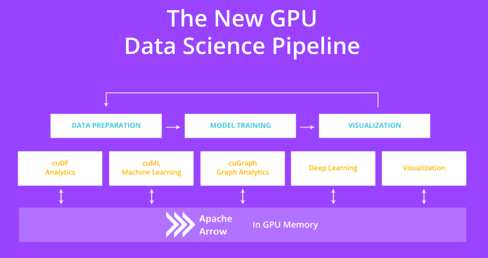

<!---
    MIT License

    Modifications Copyright (C) 2025 Advanced Micro Devices, Inc. All rights reserved.

    Permission is hereby granted, free of charge, to any person obtaining a copy
    of this software and associated documentation files (the "Software"), to deal
    in the Software without restriction, including without limitation the rights
    to use, copy, modify, merge, publish, distribute, sublicense, and/or sell
    copies of the Software, and to permit persons to whom the Software is
    furnished to do so, subject to the following conditions:

    The above copyright notice and this permission notice shall be included in all
    copies or substantial portions of the Software.

    THE SOFTWARE IS PROVIDED "AS IS", WITHOUT WARRANTY OF ANY KIND, EXPRESS OR
    IMPLIED, INCLUDING BUT NOT LIMITED TO THE WARRANTIES OF MERCHANTABILITY,
    FITNESS FOR A PARTICULAR PURPOSE AND NONINFRINGEMENT. IN NO EVENT SHALL THE
    AUTHORS OR COPYRIGHT HOLDERS BE LIABLE FOR ANY CLAIM, DAMAGES OR OTHER
    LIABILITY, WHETHER IN AN ACTION OF CONTRACT, TORT OR OTHERWISE, ARISING FROM,
    OUT OF OR IN CONNECTION WITH THE SOFTWARE OR THE USE OR OTHER DEALINGS IN THE
    SOFTWARE.
-->

# <div align="left">&nbsp;hipDF - GPU DataFrames on AMD GPUs</div>

> [!CAUTION] 
> This release is an *early-access* software technology preview. Running production workloads is *not* recommended.
***
**NOTE:** This README is derived from the original RAPIDSAI project's README. More care is necessary to remove/modify parts that are only applicable to the original version.
**NOTE:** In source code, hipMM uses the `cudf` namespace/naming conventions like the original cuDF project (which it is derived from).

## Resources

- [Try cudf.pandas now](https://nvda.ws/rapids-cudf): Explore `cudf.pandas` on a free GPU enabled instance on Google Colab!
- [Install](https://docs.rapids.ai/install): Instructions for installing cuDF and other [RAPIDS](https://rapids.ai) libraries.
- [cudf (Python) documentation](https://docs.rapids.ai/api/cudf/stable/)
- [libcudf (C++/CUDA) documentation](https://docs.rapids.ai/api/libcudf/stable/)
- [RAPIDS Community](https://rapids.ai/learn-more/#get-involved): Get help, contribute, and collaborate.

## Overview

Built based on the [Apache Arrow](http://arrow.apache.org/) columnar memory format, hipDF is a GPU DataFrame library for loading, joining, aggregating, filtering, and otherwise manipulating data.

hipDF provides a pandas-like API that will be familiar to data engineers & data scientists, so they can use it to easily accelerate their workflows without going into the details of HIP programming.

For example, the following snippet downloads a CSV, then uses the GPU to parse it into rows and columns and run calculations:
```python
import cudf, requests
from io import StringIO

url = "https://github.com/plotly/datasets/raw/master/tips.csv"
content = requests.get(url).content.decode('utf-8')

tips_df = cudf.read_csv(StringIO(content))
tips_df['tip_percentage'] = tips_df['tip'] / tips_df['total_bill'] * 100

# display average tip by dining party size
print(tips_df.groupby('size').tip_percentage.mean())
```

Output:
```
size
1    21.729201548727808
2    16.571919173482897
3    15.215685473711837
4    14.594900639351332
5    14.149548965142023
6    15.622920072028379
Name: tip_percentage, dtype: float64
```

For additional examples, browse our complete [API documentation](https://docs.rapids.ai/api/cudf/stable/), or check out our more detailed [notebooks](https://github.com/rapidsai/notebooks-contrib).

## Quick Start

**NOTE:** Currently, a docker image is not available for AMD GPUs.

## Installation

**NOTE(NVIDIA GPUs):** We currently support only AMD GPUs. Use the RAPIDS package for NVIDIA GPUs.

### ROCM/GPU requirements

* ROCm HIP SDK compilers version 6.3+
* Officially supported architecture (gfx90a, gfx942, gfx1100).

### CUDA/GPU requirements

* CUDA 11.2+
* NVIDIA driver 450.80.02+
* Volta architecture or better (Compute Capability >=7.0)

### Pip

cuDF can be installed via `pip` from the NVIDIA Python Package Index.
Be sure to select the appropriate cuDF package depending
on the major version of CUDA available in your environment:

For CUDA 11.x:

```bash
pip install --extra-index-url=https://pypi.nvidia.com cudf-cu11
```

For CUDA 12.x:

```bash
pip install --extra-index-url=https://pypi.nvidia.com cudf-cu12
```

### Conda

**NOTE:** Currently, this option is not supported for AMD GPUs.

hipDF can be installed with conda (via [miniconda](https://conda.io/miniconda.html) or the full [Anaconda distribution](https://www.anaconda.com/download)) from the `rapidsai` channel:

```bash
# NOTE: Conda installation not supported for hipDF for AMD GPUs.
conda install -c rapidsai -c conda-forge -c nvidia \
    cudf=25.02 python=3.12 cuda-version=12.8
```

We also provide [nightly Conda packages](https://anaconda.org/rapidsai-nightly) built from the HEAD
of our latest development branch.

Note: hipDF is supported only on Linux, and with Python versions 3.9 and later.

See the [RAPIDS installation guide](https://docs.rapids.ai/install) for more OS and version info.

## Build/Install from Source
See build [instructions](CONTRIBUTING.md#setting-up-your-build-environment).


## Open GPU Data Science

The RAPIDS suite of open source software libraries aim to enable execution of end-to-end data science and analytics pipelines entirely on GPUs. It relies on NVIDIA® CUDA® primitives for low-level compute optimization, but exposing that GPU parallelism and high-bandwidth memory speed through user-friendly Python interfaces.

<p align="center"></p>

### Apache Arrow on GPU

The GPU version of [Apache Arrow](https://arrow.apache.org/) is a common API that enables efficient interchange of tabular data between processes running on the GPU. End-to-end computation on the GPU avoids unnecessary copying and converting of data off the GPU, reducing compute time and cost for high-performance analytics common in artificial intelligence workloads. As the name implies, hipDF uses the Apache Arrow columnar data format on the GPU. Currently, a subset of the features in Apache Arrow are supported.
