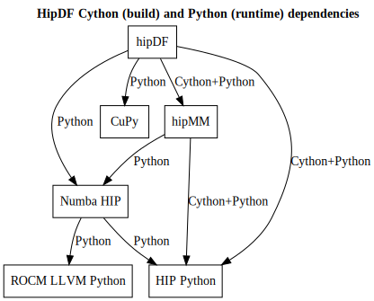

<!---
    MIT License

    Copyright (C) 2025 Advanced Micro Devices, Inc. All rights reserved.

    Permission is hereby granted, free of charge, to any person obtaining a copy
    of this software and associated documentation files (the "Software"), to deal
    in the Software without restriction, including without limitation the rights
    to use, copy, modify, merge, publish, distribute, sublicense, and/or sell
    copies of the Software, and to permit persons to whom the Software is
    furnished to do so, subject to the following conditions:

    The above copyright notice and this permission notice shall be included in all
    copies or substantial portions of the Software.

    THE SOFTWARE IS PROVIDED "AS IS", WITHOUT WARRANTY OF ANY KIND, EXPRESS OR
    IMPLIED, INCLUDING BUT NOT LIMITED TO THE WARRANTIES OF MERCHANTABILITY,
    FITNESS FOR A PARTICULAR PURPOSE AND NONINFRINGEMENT. IN NO EVENT SHALL THE
    AUTHORS OR COPYRIGHT HOLDERS BE LIABLE FOR ANY CLAIM, DAMAGES OR OTHER
    LIABILITY, WHETHER IN AN ACTION OF CONTRACT, TORT OR OTHERWISE, ARISING FROM,
    OUT OF OR IN CONNECTION WITH THE SOFTWARE OR THE USE OR OTHER DEALINGS IN THE
    SOFTWARE.
-->

---
myst:
  html_meta:
    "description": "ROCm Data Science (ROCm-DS) library for Data Frames."
    "keywords": "ROCm, ROCm-DS, Data Science, RAPIDS, AMD, CUDA, Data Frames, SDK"
---

# Installing hipDF

> **IMPORTANT:**
> ROCm-DS is not distributed through prebuilt packages via Conda or PyPI for this project and its dependencies. You need to build hipDF from source.
> This documents walks you through all necessary steps for the build process.
> For your convenience, these steps are contained in the [install_hipdf.sh](../../install_hipdf.sh) script. Read and edit the script carefully to adapt the environment variables for your installation.

## Install from Source

> **IMPORTANT:**
> This guide assumes an AMD MI200 series GPU and thus uses the architecture code `gfx90a` as the build target (``HCC_AMDGPU_TARGET``). Customize this to your needs.

### Installation Procedure

You will perform the following steps:

1. Install ROCm 6.4.0 release (or later)
2. Install Conda
3. Create build folder
    * Download ROCm CuPy for ROCm-DS
    * Download hipMM
    * Download hipDF
4. Build CuPy wheel
5. Create and activate hipDF Conda environment `hipdf_dev`
6. Install CuPy wheel into `hipdf_dev`
7. Install Numba HIP into `hipdf_dev`
8. Install hipMM into `hipdf_dev`
9. Install hipDF into `hipdf_dev`

> **NOTE:**
> The `install_hipdf.sh` script deviates slightly in the order of operations. One key difference is that it assumes that hipDF is already downloaded.

#### Step 1: Install ROCm

You must have a full ROCm 6.4.0 or later installation on your system. See [ROCm installation for Linux](<https://rocm.docs.amd.com/projects/install-on-linux/en/latest/>) for more information. 
This guide assumes that the ROCm path is `/opt/rocm`.

#### Step 2: Install Conda

`hipDF` must be built inside of a predefined Conda environment to ensure that it is working properly. A minimum free version of Conda is [Miniconda](https://docs.anaconda.com/miniconda/#).

#### Cython and Python dependencies: CuPy, Numba HIP, hipMM, HIP Python, ROCm LLVM Python

While the hipDF build process fetches C++ dependencies itself, it has Cython and Python dependencies (CuPy, Numba HIP, hipMM, HIP Python, ROCm LLVM Python) that need to be installed into the hipDF Conda environment before you can build the project. The following diagram gives an overview:



#### Step 3: Create build folder

```bash
mkdir -p /tmp/hipdf # NOTE: feel free to adapt
cd /tmp/hipdf
git clone https://github.com/ROCm-DS/hipDF hipdf -b release/1.0.x
git clone https://github.com/ROCm-DS/hipMM hipmm -b release/1.0.x
git clone https://github.com/ROCm/cupy cupy -b rocmds/develop/13.4.x
```

#### Step 4: Create CuPy wheel

> **IMPORTANT:**
> You must provide one or more AMD GPU architectures here via the
> `HCC_AMDGPU_TARGET` environment variable (separator: `,`). Refer to
> [Release Compatibility](https://rocm.docs.amd.com/en/latest/compatibility/compatibility.html)
> for supported GPU targets.

You must create the Conda
environment file (`cupy_dev.yaml`) as shown below. Place this file in the
`/tmp/hipdf/cupy` folder. You can adapt the Python version to your installed
version.

```yaml
# file: cupy.yaml
channels:
- conda-forge
dependencies:
- python~=3.10.0 # NOTE: adapt to your needs, must match hipDF Python version
```

Then build the conda `cupy_dev` environment as follows:

```bash
cd /tmp/hipdf/cupy

# initialize conda environment
conda env create -n cupy_dev -f cupy_dev.yaml
conda activate cupy_dev # now we are working in the `cupy_dev` conda env

pip install --upgrade pip # always recommended

# cd <path/to/parent-directory>
git submodule update --init
export CUPY_INSTALL_USE_HIP=1
export ROCM_HOME=/opt/rocm        # NOTE: adapt to your environment
export HCC_AMDGPU_TARGET="gfx90a" # NOTE: adapt to your AMD GPU architecture
python3 setup.py --cupy-package-name amd-cupy-for-rocmds bdist_wheel      # build the wheel
```

> **NOTE:**
> At this time you can deactivate the conda cup_dev environment using
> `conda deactivate`, though it will be deactivated automatically when you
> activate the next environment (`hipdf_dev`) in the following steps.

#### Step 5: Create and activate hipDF Conda environment `hipdf_dev`.

Create the `hipdf_dev` Conda environment:

```bash
cd /tmp/hipdf/hipdf

conda env create --name hipdf_dev --file conda/environments/all_rocm_arch-x86_64.yaml
```

Activate the environment via:

```bash
conda activate hipdf_dev
```

#### Step 6: Install CuPy into `hipdf_dev`

```bash
# IMPORTANT: conda env `hipdf_dev` must be active

pip install /tmp/hipdf/cupy/dist/amd-cupy*.whl
```

#### Step 7: Install Numba HIP into `hipdf_dev`.

> **IMPORTANT:**
> You must provide the version of your ROCm installation here via the optional dependency key `rocm-X-Y-Z`.

```bash
# IMPORTANT: conda env `hipdf_dev` must be active

pip install --upgrade pip
pip config set global.extra-index-url https://test.pypi.org/simple
pip install numba-hip[rocm-6-3-0]@git+https://github.com/rocm/numba-hip.git # NOTE: adapt ROCm key to your Python version
```

#### Step 8: Install hipMM into `hipdf_dev`.

Install the `hipMM` Python wheel using the hipMM `build.sh` script as shown below:

```bash
# IMPORTANT: conda env `hipdf_dev` must be active
cd /tmp/hipdf/hipmm
export CXX="hipcc"  # Cython CXX compiler, adapt to your environment
export CMAKE_PREFIX_PATH="${CMAKE_PREFIX_PATH}:/opt/rocm/lib/cmake" # NOTE: ROCm CMake package location, adapt to your environment

./build.sh rmm # Build rmm and install into `hipdf_dev` conda env.
```

Note that no architecture must be set here as the hipMM installation does not compile any device code.

#### Step 9: Install hipDF into `hipdf_dev`

> **IMPORTANT:**
> You must provide one or more AMD GPU architectures here via
> the `CUDF_CMAKE_HIP_ARCHITECTURES` environment variable (separator: `;`).

Install the `hipdf` Python package as shown below:

```bash
# IMPORTANT: conda env `hipdf_dev` must be active

cd /tmp/hipdf/hipdf
# export CXX="hipcc"  # Cython CXX compiler, adapt to your environment (This was set two steps up? Is it needed here?)
# export CMAKE_PREFIX_PATH=${CMAKE_PREFIX_PATH}:/opt/rocm/lib/cmake (This was set two steps up...)

export PARALLEL_LEVEL=16 # NOTE: number of build threads, adapt as needed

export LDFLAGS="-Wl,-O2 -Wl,--sort-common -Wl,--as-needed -Wl,-z,relro -Wl,-z,now -Wl,--disable-new-dtags -Wl,--gc-sections -Wl,--allow-shlib-undefined -Wl,-rpath,/lib/x86_64-linux-gnu/ -Wl,-rpath,${CONDA_PREFIX}/lib -Wl,-rpath-link,${CONDA_PREFIX}/lib -L${CONDA_PREFIX}/lib"

export CUDF_CMAKE_HIP_ARCHITECTURES="gfx90a" # NOTE: adapt to your AMD GPU architecture

bash build.sh libcudf cudf # NOTE: the build target is called 'cudf'
```

## Installation Summary

You have just completed installing hipDF for use in the conda `hipdf_dev`
environment. You must activate the `hipdf_env` before code like `import hipdf`
will work.

```bash
conda activate hipdf_dev
```
